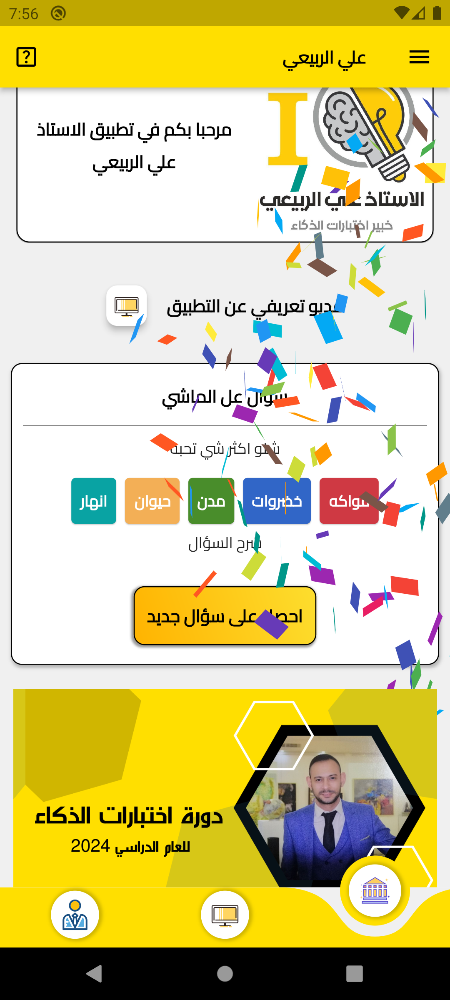

# Lecture 1: flutter Project file structuring and how to organize your widgets

• How to structure flutter project and basic for clean code.

• How to organize your widgets in flutter project.

• How to turn an app idea into flutter project

• How to plan your project work to speed up development.  

• How to make the over all skeleton of the project.  

In this lecture, we will learn how to structure a Flutter project and organize our widgets effectively.

---

## Project Structure

- `utilities` folder: This folder will contain the part of the app that is not related to the UI.
- `screens` folder: This folder will contain the main screen of the application.
- `widgets` folder: This folder will store reusable widgets to increase consistency and facilitate maintenance.
- `theme`: This folder will contain files related to the app's theme, such as colors, fonts, and styles.
- `theme/dark` folder: This subfolder will contain files specific to the dark theme.
- `theme/light` folder: This subfolder will contain files specific to the light theme.
- `constants` some data that will be uesd repeatedly.

## Creating an App Icon and Splash Screen in Flutter

## App Font

**using google fonts**: To use custom fonts in Flutter, we'll use the `google_fonts` package. Add it to your `pubspec.yaml` file under `dependencies`:

```yaml
dependencies:
  flutter:
    sdk: flutter
  google_fonts: ^2.1.0
```

## Using Custom Fonts in Flutter

we will install them from alfont website for arabic fonts.

1. **Add your font files**: Place your custom font files in your project. It's recommended to put them in a `fonts` directory at the root of your project. The font files should be in `.ttf` or `.otf` format.

2. **Declare your fonts in `pubspec.yaml`**: In your `pubspec.yaml` file, add the following configuration under `flutter`:

```yaml
flutter:
  fonts:
    - family: CustomFont
      fonts:
        - asset: fonts/CustomFont-Regular.ttf
        - asset: fonts/CustomFont-Bold.ttf
          weight: 700
```

3. Replace CustomFont with the name of your font, and replace fonts/CustomFont-Regular.ttf and fonts/CustomFont-Bold.ttf with the paths to your font files. The weight attribute specifies the font weight, with 400 being regular and 700 being bold.

Use your custom font: Now you can use your custom font in your Flutter widgets. For example:

```dart
Text(
  'This is custom font',
  style: TextStyle(
    fontFamily: 'CustomFont',
    fontWeight: FontWeight.bold,
  ),
)
```

4. create custom classes for diffrent font sizes to reuse them.

---

### App Icon

1. **Install the dependency**: To create an app icon in Flutter, we'll use the `flutter_launcher_icons` package. Add it to your `pubspec.yaml` file under `dev_dependencies`:

```yaml
dev_dependencies:
  flutter_launcher_icons: "^0.9.2"
```

Add your icon: Place your app icon inside your project. It's recommended to put it in the assets/images directory. The icon should be a square png image with dimensions 1024x1024 pixels.

Configure the package: In your pubspec.yaml file, add the following configuration under flutter:

```yaml
flutter_icons:
  android: true
  ios: true
  image_path: "assets/images/icon.png"
```

```terminal
flutter pub get
flutter pub run flutter_launcher_icons:main
```

---

### Splash Screen

Install the dependency: To create a splash screen, we'll use the ```flutter_native_splash``` package. Add it to your pubspec.yaml file under dev_dependencies:

```yaml
dev_dependencies:
  flutter_native_splash: "^1.2.0"
```

Configure the package: In your pubspec.yaml file, add the following configuration:

```yaml
flutter_native_splash:
  image: assets/images/splash.png
  color: "42a5f5"
```

Replace "42a5f5" with the hex color code you want for the background of your splash screen.

3.Generate the splash screen: Run the following command in your terminal:
This will generate a native splash screen for both Android and iOS.

```terminal
flutter pub get
flutter pub run flutter_native_splash:create
```

Remember to run flutter pub get after modifying your pubspec.yaml file to fetch the packages.

This tutorial provides a basic guide on how to create an app icon and splash screen in Flutter. For more advanced configurations, students can refer to the documentation of the respective packages.

## Widget Organization

To encapsulate our code and improve reusability, we will create separate widgets for different parts of our application. Each widget will have its own file, making it easier to manage and modify.

---

To turn your app idea into a structured project, you'll need to break it down into classes and organize them within screens and widgets. This will help you create a clear and organized codebase.

Here's a step-by-step process to follow:

Identify the main components of your app idea: Start by identifying the key entities or concepts in your educational app. For example, you mentioned teachers and courses. These could be potential classes in your project.

Create classes for each component: Once you have identified the main components, create a class for each one. For example, you could create a Teacher class and a Course class. These classes will represent the data and behavior associated with each component.

Define properties and methods: Within each class, define the properties (attributes) and methods (functions) that are relevant to that component. For example, the Teacher class might have properties like name, email, and subject, along with methods like addCourse() or updateProfile().

Organize classes within screens: Think about the screens or views in your app and how they relate to the classes you've created. For example, you might have a TeacherProfileScreen that displays information about a specific teacher. In this screen, you would use an instance of the Teacher class to populate the UI with the relevant data.

Use widgets to build UI components: Within each screen, you'll use widgets to build the user interface. Widgets are reusable UI components in Flutter. You can use built-in widgets or create custom ones. For example, you might use a Text widget to display the teacher's name and a ListView widget to display a list of courses.

By following this process, you'll be able to structure your app idea into classes, screens, and widgets, making it easier to develop and maintain your application. Remember to keep your code modular and organized, and don't hesitate to refactor or make changes as you progress in your development journey.

 This was our first lecture. It was very easy one, and it was very basic one to get everyone on the same page now. And the further lecture, the Material will be harder and would be more beneficial to you.

| educational  | platfroms apps |
|---------|---------|
|  |  |

## Additional Resources

For more information on project structuring and widget organization in Flutter, you can refer to the following resources:

- [Flutter Documentation](https://flutter.dev/docs)
- [Flutter Widget Catalog](https://flutter.dev/widgets)
- [Flutter Cookbook](https://flutter.dev/docs/cookbook)
